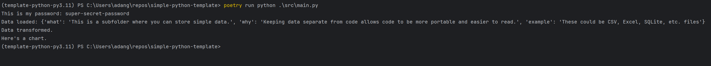

# Introduction

This is the Python project template I wish I had when I was learning how to code in Python. 
As an engineer, I knew what I wanted my code to do, but I didn't know what packages I was installing,
where they were being installed, and things got messy quickly.

This is a template for creating a robust Python project using some basic software engineering principles, where 
the code is version controlled, linted (style checked), and developed within a virtual environment so that it is 
reproducible, no matter who is running your code or where your code is running. These are the principles that I found 
would have found useful early on in my Python developer journey.

## About the tools

### Git

Git is a tool that manages and tracks changes to your files, making collaboration and version control easier. It keeps a
record of every change you make to your documents, just like taking snapshots. This means you can easily go back in time
and see the previous versions of your work. If you make a mistake or want to compare different versions, Git has got
your back.

Git is especially handy when you're working on projects with others. It allows multiple people to work on the same
files simultaneously without stepping on each other's toes. Git handles the merging of changes and resolves conflicts,
making sure everyone's contributions fit together seamlessly.

Imagine you're working on a group project or writing a research paper. With Git, you can create a repository that holds
all the project files. Each time you make a change, Git saves it along with a message explaining what you did. This
creates a timeline of your progress and makes it easy to track who made which changes.

Additionally, Git enables collaboration beyond the boundaries of your own group. You can share your repository with
others, allowing them to view your work, make their own changes, and suggest improvements. Git keeps everything
organized and ensures that changes are properly tracked and attributed.

### pyenv

It is possible to have multiple versions of Python installed at the same time. This is normally needed to run certain
packages or executables that are built using a specific version. Pyenv helps manage the installation and multiple
versions of Python.

> [!WARNING]
> **pyenv + Poetry DOES NOT play well with conda.**
> If you have previously installed Python and/or Anaconda/Miniforge/Miniconda/etc. UNINSTALL IT. The "pyenv + Poetry"
> setup does not play well with conda, nor is conda necessary. Poetry does more than conda and in a more user-friendly 
> manner (in my opinion).

> [!NOTE]
> If you installed Python from [python.org](https://www.python.org/downloads/) you'll likely only have one version
> (e.g. 3.11.2) available. This is fine to start, but if you end up working on other (older) projects that requires a 
> different version of Python, you'll need to install those.

You can use pyenv to install whatever versions of Python you would like (generally the 
[latest version](https://www.python.org/downloads/)).
You can use pyenv to install any additional version of Python you need by running `pyenv install <version>`. We
recommend a version each of 3.8, 3.9, 3.10, and 3.11. A good place to start is looking at the projects you might be
contributing to and downloading the version required for that.

### Poetry

Every Python project should lock its dependent libraries (packages) to specific versions and follow [semantic
versioning](https://semver.org/). Using a virtual environment allows you to create an isolated Python environment for
yor project where you can pin down your dependencies (packages), avoid version conflicts, and create fully
reproducible builds. To learn more about virtual environments, you can read
[this article](https://realpython.com/python-virtual-environments-a-primer/). 
My preferred tool is [Poetry](https://python-poetry.org/docs/).

## Getting Started

### Using this template

Click `Use this template` to create a new repository based on this one.

### Instantiate virtual environment
Instantiate your virtual environment within the project folder by running:
`poetry install`.

Activate your virtual environment by running `poetry shell`.

#### Poetry configuration

A project will typically have three files that pertain to configuring the Poetry installation:

* `poetry.toml`: Defines the local [configuration](https://python-poetry.org/docs/configuration/) of Poetry. It is a 
  best practice to create the virtual environment in the project's root directory. This limits confusion as to which 
  virtual environment is used for which project
* `pyproject.toml`: Defines the Poetry project (your Python project), including metadata about your project and its 
  dependencies (required packages)
* `poetry.lock`: This won't be shown here, but once you've dones a `poetry install` on a new project, a `poetry.
  lock` file will be created. This locks the specific versions that you use during the development of your project. 
  This ensures reproducibility. When you're working off of an exisiting Poetry project, you'll run `poetry install 
  --sync` to honor all the "locked in" versions of the packages used in the project.

### Install pre-commit

Pre-commit is a way to identify simple issues before submission to code review. 
We run pre-commit hooks (checks) on every commit to automatically point out issues in code such as missing semicolons, 
trailing whitespace, and debug statements. By pointing these issues out before code review, this allows a code 
reviewer (or anyone else looking at our code) to focus on the architecture of a change while not wasting time with 
trivial style nitpicks.

Ensure the pre-commit hooks are installed by running (in your virtual environment): `pre-commit install`

Then run `pre-commit run --all-files`.

### Create a Jupyter notebook kernel

To use Jupyter Notebook during your development, you can create a kernel that reflects the Poetry
environment by running `ipython kernel install --name pipeline_water_wells --user`. Then you can run `jupyter notebook`
from your active shell and set the correct kernel in both new and existing notebooks.

### Add `.env` file for secrets

Sometimes, to connect to data sources, you'll need to specify some usernames and passwords to access the various
databases. This information should be kept in a `.env` file and NEVER shared or committed to a public repository.

Create a `.env` file in the root directory to store API keys, passwords, connection string, etc.:

```bash
SUPER_SECRET_PASSWORD='super-secret-password'
```

## Project structure

The goal is to be able to execute your code by running `poetry run python src/main.py`. You can run this
command in the terminal to check if you have set up the project correctly (including the `.env` file). The output
should look something like below:



Ideally, you will create all of your code within the main() function, as shown in the `main.py` file. If your
supporting functions are long, you can keep those in a separate Python file to improve readability.

### Tests

In software engineering, it is important to test code to ensure that it works as expected. This can be done by
writing a function that tests the code and applying it to a small table to verify that it works correctly. By doing
this, you can be confident that the function works properly and any errors are happening elsewhere in the code.

Tests are located in the subfolder `tests/`

## Pandas vs Polars

Pandas is a very popular package that allows users to structure data in tables, aka DataFrames (like a what you might
see in a spreadsheet) and manipulate it. Polars is a high-performing DataFrame library similar to Pandas but
performs much faster for most data manipulation. Polars is a good choice if your DataFrames are very large (> 1MM rows).

## References & Additional Resources

- [Test Driven Development](https://medium.com/@patrick.tolosa/tdd-for-dummies-step-by-step-6fa828af21d0)